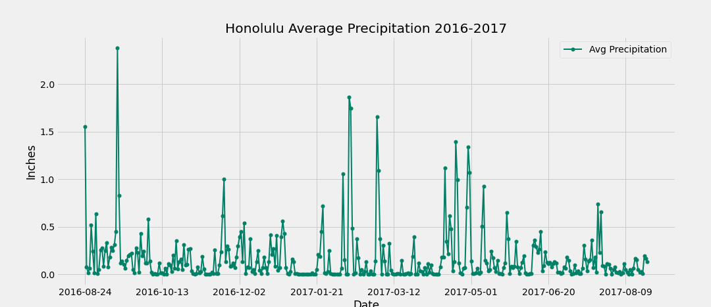
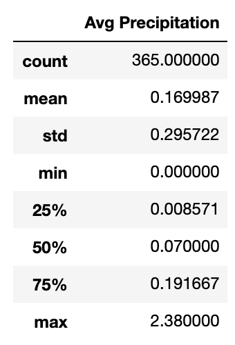
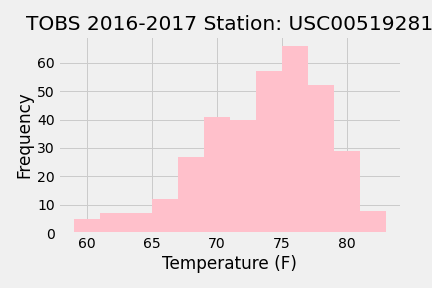
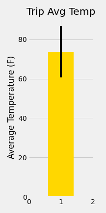

# sqlalchemy-challenge

*Wish you were here!* :hibiscus:

- - - - - - - - - - - - - - - - - - - - - - - - - - - - - - - - - - - - - - - - -

## Table of Contents
* [General info](#general-info)
* [Objectives](#objectives)
* [Step-1](#Step-1)
* [Step-2](#Step-2)
* [Bonus Analysis](#bonus-analysis)
* [Technologies](#technologies)

- - - - - - - - - - - - - - - - - - - - - - - - - - - - - - - - - - - - - - - - -

## General info

I've decided to treat myself to a long holiday vacation in Honolulu, Hawaii! To help with trip planning, I did some climate analysis on the area. :desert_island:

## Objectives 

1. Use queries to analyze weather station and precipitation data for the last year.
2. Design a Flask API based on the queries that you have just developed. 

Bonus: Calculate and visualize average temperature for dates of my trip!

## Step 1

### Climate Analysis and Exploration

**Precipitation Analysis**

**Station Analysis**

## Step 2

### Climate App

**Routes**

The routes I used for my Flask API are here:
[routes](app.py)

## Bonus Analysis

Based on my analysis, my vacation this coming May will be warm and beautiful! :sun_behind_small_cloud: 

## Technologies

sqlalchemy

jupyternotebook

Python

Matplotlib